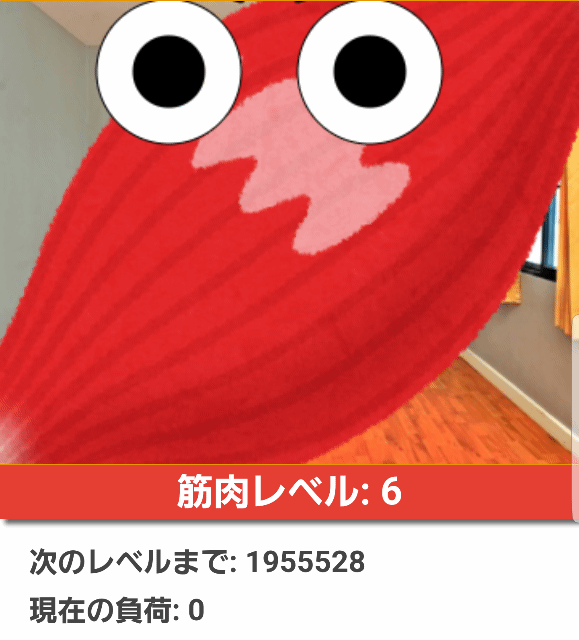
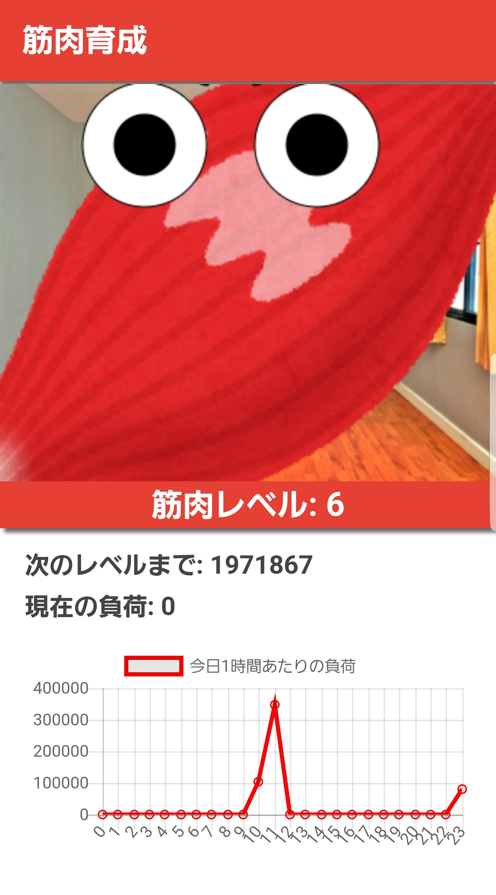

# Muscle-Breeder

💪💪💪💪💪💪💪💪💪💪  
💪💪筋肉は裏切らない💪💪💪  
💪💪💪💪💪💪💪💪💪💪  

## どんなアプリ？

筋肉はいつだってあなたのそばにいる存在。  
そんな筋肉をより可愛がってあげられるアプリです。

放置することで筋肉を育てるシミュレーションなんてもう古い！  
実際に筋肉に刺激を与えることでバーチャルではない筋肉を育てよう💪💪💪

https://shisoaqron.github.io/muscle-breeder/client/

## アプリの使い方

0. firebaseの準備をしておきます(説明は省略)
1. myowareを可愛がりたい筋肉に貼ります
2. serverプログラムを起動します  
3. いっぱい鍛えましょう💪💪💪
4. clientで筋肉の動きを見たり，記録を確認しましょう

## アプリの構成

- client : これまでに鍛えた記録と現在の筋肉に会えます
  - processing.jsによる描写
  - firebaseによるログと状態管理

- server : 筋肉のセンシングをします
  - node.jsでobnizを操作
    - myowareで筋肉の活動を取得
  - 値をfirebaseに格納

## Special Thanks

これは[ABpro2018](https://abpro.jp/2018/)のために製作したアプリです。  
特にclient実装は[salmoncode](https://github.com/salmoncode)氏の協力なしではクオリティの高いもの、かつ間にあわせるのは難しかったと思います。この場を借りて感謝を。